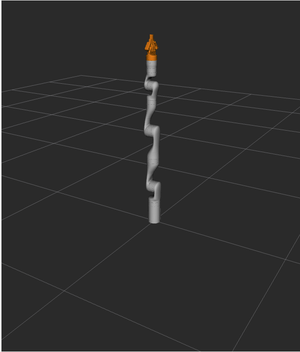
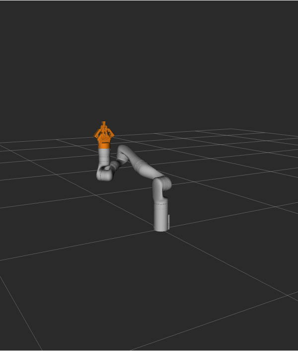

Your First Python MoveIt Project
=============================

This tutorial will step you through writing your first Python application with MoveIt.

Warning: Most features in MoveIt will not work properly since additional parameters are required for full Move Group functionality. For a full setup, please continue with the :doc:`Move Group Python Interface Tutorial </doc/examples/move_group_interface/move_group_interface_tutorial_py>` (TODO).

Prerequisites
-------------

If you haven't already done so, make sure you've completed the steps in :doc:`Getting Started </doc/tutorials/getting_started/getting_started>`.

This tutorial assumes you understand the basics of ROS 2.
To prepare yourself for this please complete the `Official ROS 2 Tutorials <https://docs.ros.org/en/{DISTRO}/Tutorials.html>`_ up until "Writing a simple publisher and Subscriber (Python)".

Steps
-----

1 Create a package
^^^^^^^^^^^^^^^^^^

Open a terminal and `source your ROS 2 installation <https://docs.ros.org/en/{DISTRO}/Tutorials/Configuring-ROS2-Environment.html>`_ so that ``ros2`` commands will work.

Navigate to your ``ws_moveit`` directory you created in the :doc:`Getting Started Tutorial </doc/tutorials/getting_started/getting_started>`.

Change directory into the ``src`` directory, as that is where we put our source code.

Create a new package with the ROS 2 command line tools:

.. code-block:: bash

  ros2 pkg create \
   --build-type ament_python \
   --dependencies moveit_py rclpy \
   --node-name hello_moveit hello_moveit_py

The output of this will show that it created some files in a new directory.

Note that we added ``moveit_py`` and ``rclpy`` as dependencies.
This will create the necessary changes in the ``package.xml`` and ``setup.py`` file so that we can depend on these two packages.

Open the new source file created for you at
``ws_moveit/src/hello_moveit/hello_moveit/hello_moveit.py`` in your favorite editor.

2 Create a ROS Node and Executor
^^^^^^^^^^^^^^^^^^^^^^^^^^^^^^^^

This first block of code is a bit of boilerplate, similar to the python tutorials.

.. code-block:: Python

    import rclpy
    import moveit
    from moveit import MoveGroupInterface
    from geometry_msgs.msg import Pose, Quaternion, Point

    def main(args=None):
        rclpy.init(args)
        node = rclpy.node("hello_moveit")
        node.get_logger().info("Hi from hello_moveit")
        # Next step goes here

    if __name__ == '__main__':
        main()

2.1 Build and Run
~~~~~~~~~~~~~~~~~

We will build and run the program to see that everything is right before we move on.

Change directory back to the workspace directory ``ws_moveit`` and run this command:

.. code-block:: bash

  colcon build --symlink-install

After this succeeds, **open a new terminal**, then source the workspace environment script in that new terminal so that we can run our program.

.. code-block:: bash

  cd ~/ws_moveit
  source install/setup.bash

Run your program and see the output.

.. code-block:: bash

  ros2 run hello_moveit_py hello_moveit

The program should run, print ``Hi from hello_moveit.`` and exit without error.

2.2 Examine the code
~~~~~~~~~~~~~~~~~~~~

The imports at the top are python modules for ROS and MoveIt that we will use later.

After that, we have the normal call to initialize rclpy, and then we create our Node.

.. code-block:: python

    node = Node("hello_moveit")

Creating a Node is not strictly necessary to use the python ``move_group_interface``, but we do it here to show that it can be done.
The ``move_group_interface`` creates it's own C++ node in the background, but your python code needs to make it's own node to interact with messages/services/etc.
You can subclass ``rclpy.node.Node`` as is done in the tutorials instead of creating just a Node object as is done in this example..

Next, we use the node's logger to log a message

.. code-block:: python

    node.get_logger().info("Hi from hello_moveit.")

3 Plan and Execute using MoveGroupInterface
^^^^^^^^^^^^^^^^^^^^^^^^^^^^^^^^^^^^^^^^^^^

In place of the comment that says "Next step goes here", add this code:

.. code-block:: python

    # A MoveGroupInterface wraps the C++ MoveGroupInterface.
    # It creates a node called "hello_moveit_interface" that runs in the background and
    # communicates (via publishers/subscribers) with an already running move_group node
    move_group_interface = MoveGroupInterface("hello_moveit_interface", "manipulator")

    # Set the target pose
    target_pose = Pose(quaternion=Quaternion(w=1),
                    position=Point(x=0.28, y=-0.2, z=0.5))

    move_group_interface.setPoseTarget(target_pose)

    # Plan the motion
    (result, plan) = move_group_interface.plan()

    # Execute the motion if planning was successful
    if result.val == result.SUCCESS:
        move_group_interface.execute(plan)
    else:
        print("Planning Failed")

3.1 Build and Run
~~~~~~~~~~~~~~~~~

Because we used a ``colcon build --symlink-install`` we can change the python file without re-building.

We need to re-use the demo launch file from the MoveIt Quickstart In RViz tutorial to start RViz and the MoveGroup node.
In a separate terminal, source the workspace and then execute this:

.. code-block:: bash

  ros2 launch moveit2_tutorials demo.launch.py

Then in the ``Displays`` window under ``MotionPlanning/Planning Request``, uncheck the box ``Query Goal State``.

In a third terminal, source the workspace and run your program.

.. code-block:: bash

  ros2 run hello_moveit_py hello_moveit

This should cause the robot in RViz to move and end up in this pose:

Note that if you ran the node ``hello_moveit`` without launching the demo launch file first, it will wait for 10 seconds and then print this error and exit.

.. code-block:: bash

  [ERROR] [1644181704.350825487] [hello_moveit]: Could not find parameter robot_description and did not receive robot_description via std_msgs::msg::String subscription within 10.000000 seconds.

This is because the ``demo.launch.py`` launch is starting the ``MoveGroup`` node that provides the robot description.
When ``MoveGroupInterface`` is constructed, it looks for a node publishing a topic with the robot description.
If it fails to find that within 10 seconds, it prints this error and terminates the program.

3.2 Examine the code
~~~~~~~~~~~~~~~~~~~~

The first thing we do is create the ``MoveGroupInterface``.
This object will be used to interact with ``move_group``, which allows us to plan and execute trajectories.
Note that this is the only mutable object that we create in this program.
Another thing to take note of is the second argument to the ``MoveGroupInterface`` object we are creating here: ``"manipulator"``.
That is the group of joints as defined in the robot description that we are going to operate on with this ``MoveGroupInterface``.

.. code-block:: python

   # A MoveGroupInterface wraps the C++ MoveGroupInterface.
   # It creates a node called "hello_moveit_interface" that runs in the background and
   # communicates (via publishers/subscribers) with an already running move_group node
   move_group_interface = MoveGroupInterface("hello_moveit_interface", "manipulator")

Then, we set our target pose and plan. Note that only the target pose is set (via ``setPoseTarget``).
The starting pose is implicitly the position published by the joint state publisher, which could be changed using the
``MoveGroupInterface::setStartState*`` family of functions (but is not in this tutorial).

.. code-block:: python

    # Set the target pose
    target_pose = Pose(quaternion=Quaternion(w=1),
                    position=Point(x=0.28, y=-0.2, z=0.5))

    move_group_interface.setPoseTarget(target_pose)

Finally, we execute our plan if planning was successful, otherwise we log an error:

.. code-block:: python

    # Execute the motion if planning was successful
    if result.val == result.SUCCESS:
        move_group_interface.execute(plan)
    else:
        print("Planning Failed")

Summary
-------

* You created a ROS 2 package and wrote your first python program using MoveIt.
* You learned about using the MoveGroupInterface to plan and execute moves.
* :codedir:`Here is a copy of the full hello_moveit.py source at the end of this tutorial<tutorials/your_first_project_py/hello_moveit.py>`.
